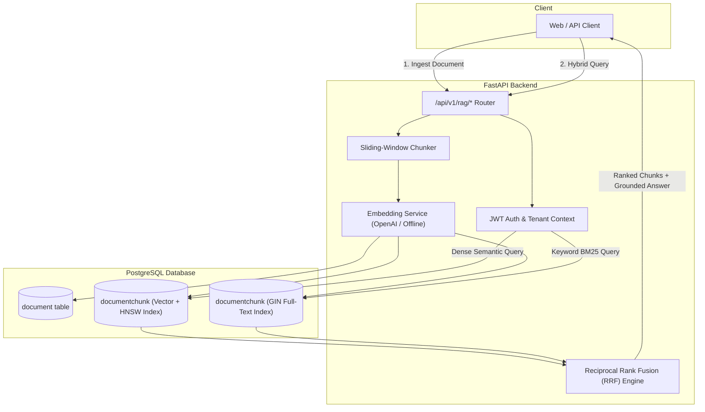

# Full Stack FastAPI Template + Multi-Tenant RAG

[](https://python.org)
[](https://fastapi.tiangolo.com)
[](https://www.postgresql.org)
[](https://github.com/pgvector/pgvector)
[](https://pytest.org)
[](./LICENSE)

Production-ready Full Stack FastAPI web application template with **Native Multi-Tenant RAG (Retrieval-Augmented Generation)** and **pgvector Hybrid Search**, eliminating external vector database overhead while ensuring strict enterprise data isolation.

---

## 🧠 What Makes This Template Different?

Most FastAPI templates only cover traditional CRUD operations. When teams build AI features, they are often forced to introduce external vector databases (e.g. Pinecone, Chroma, Qdrant), leading to duplicate storage costs, syncing bugs, and data security risks.

This template solves that by integrating **`pgvector`** directly into the existing **PostgreSQL + SQLModel** stack:



### Key AI / RAG Capabilities:
* 💾 **No External Vector Database Needed**: Dense 1536-dim embeddings stored alongside relational data using official `pgvector/pgvector:pg17` and HNSW indexing (`vector_cosine_ops`).
* 🔒 **Strict Multi-Tenant Isolation**: Chunks and embeddings are indexed with `owner_id`. A user can never retrieve or view vectors belonging to another user.
* ⚡ **Hybrid Search with RRF**: Combines dense semantic similarity (`<=>` cosine distance) with PostgreSQL full-text search (`tsvector` & `ts_rank_cd`) through **Reciprocal Rank Fusion**:
  $$\text{RRF}(d) = \sum_{m \in \{\text{dense}, \text{keyword}\}} \frac{1}{60 + \text{rank}_m(d)}$$
* 🤖 **Offline & CI/CD Friendly**: Includes a deterministic embedding fallback that allows 100% of test suites to pass locally without requiring a paid OpenAI API key.

---

## Technology Stack and Features

- ⚡ [**FastAPI**](https://fastapi.tiangolo.com) for the Python backend API.
  - 🧰 [SQLModel](https://sqlmodel.tiangolo.com) for Python SQL database interactions (ORM).
  - 🔍 [Pydantic](https://docs.pydantic.dev), used by FastAPI, for data validation and settings management.
  - 💾 [PostgreSQL + pgvector](https://github.com/pgvector/pgvector) as the unified relational + vector database.
- 🧠 **Native RAG Pipeline**:
  - Ingestion API with sliding-window text chunking and overlap.
  - Hybrid search and question answering with inline source citations.
- 🚀 [React](https://react.dev) for the frontend.
  - 🧩 Built into the backend application and served by FastAPI on the same domain as the API.
  - 💃 Using TypeScript, hooks, [Vite](https://vitejs.dev), and TanStack Router / Query.
  - 🎨 [Tailwind CSS](https://tailwindcss.com) and [shadcn/ui](https://ui.shadcn.com) for components.
  - 🤖 Automatically generated frontend client.
  - 🧪 [Playwright](https://playwright.dev) for end-to-end testing.
  - 🦇 Dark mode support.
- ☁️ [FastAPI Cloud](https://fastapicloud.com) for deployment.
- 🐋 [Docker Compose](https://www.docker.com) for local services and self-hosted deployment.
  - 📞 [Traefik](https://traefik.io) as a reverse proxy with automatic HTTPS.
- 🔒 Secure password hashing by default.
- 🔑 JWT (JSON Web Token) authentication.
- 📫 Email-based password recovery.
- ✉️ [React Email](https://react.email) for email templates.
- 📬 [Mailpit](https://mailpit.axllent.org) for local email testing.
- ✅ Full test suite with [Pytest](https://pytest.org) (63 tests).
- 🏭 CI/CD based on GitHub Actions.

---

## 📡 RAG API Quick Reference

All endpoints are authenticated using standard Bearer JWT tokens under `/api/v1/rag`:

| Method | Endpoint | Description |
| :--- | :--- | :--- |
| `POST` | `/api/v1/rag/documents` | Ingest a document (chunks text & generates vector embeddings) |
| `GET` | `/api/v1/rag/documents` | List current user's indexed documents with chunk counts |
| `GET` | `/api/v1/rag/documents/{id}` | Retrieve document details (tenant-scoped) |
| `DELETE` | `/api/v1/rag/documents/{id}` | Delete document and cascade delete all associated chunks/vectors |
| `POST` | `/api/v1/rag/search` | Execute hybrid search (Dense Vector + Full-Text Search with RRF) |
| `POST` | `/api/v1/rag/query` | Complete RAG Q&A: retrieves context and generates grounded answer |
| `POST` | `/api/v1/rag/stream` | Token-by-token SSE streaming with proactive client disconnect abort guard |

### Example: Document Ingestion

```bash
curl -X POST "http://localhost:8000/api/v1/rag/documents" \
  -H "Authorization: Bearer <YOUR_JWT_TOKEN>" \
  -H "Content-Type: application/json" \
  -d '{
    "title": "FastAPI AI Architecture Guide",
    "content": "FastAPI is ideal for AI applications due to native async I/O. Using pgvector allows storing embeddings directly in PostgreSQL with HNSW indexing.",
    "content_type": "text/plain"
  }'
```

### Example: Hybrid Search Query

```bash
curl -X POST "http://localhost:8000/api/v1/rag/search" \
  -H "Authorization: Bearer <YOUR_JWT_TOKEN>" \
  -H "Content-Type: application/json" \
  -d '{
    "query": "How to store embeddings in PostgreSQL?",
    "top_k": 3
  }'
```

### Example: Real-time Token Streaming (SSE)

```bash
curl -N -X POST "http://localhost:8000/api/v1/rag/stream" \
  -H "Authorization: Bearer <YOUR_JWT_TOKEN>" \
  -H "Content-Type: application/json" \
  -d '{
    "query": "Summarize how pgvector handles indexing in this template",
    "top_k": 3
  }'
```

---

### Dashboard Login


### Dashboard - Admin


### Dashboard - Items


### Dashboard - Dark Mode


### Interactive API Documentation


---

## Quickstart

### 1. Start Services with Docker Compose

```console
$ docker compose up -d db mailpit
```

### 2. Run Backend Locally

```console
$ cd backend
$ uv sync
$ uv run bash scripts/prestart.sh
$ uv run fastapi dev
```

The interactive OpenAPI documentation is available at `http://localhost:8000/docs`.

### 3. Run Test Suite

```console
$ cd backend
$ uv run pytest tests
```

Output:
```console
======================= 63 passed, 58 warnings in 5.91s =======================
```

---

## Documentation Links

* Backend documentation: [backend/README.md](./backend/README.md)
* Frontend documentation: [frontend/README.md](./frontend/README.md)
* General development docs: [development.md](./development.md)
* Deployment guide: [deployment.md](./deployment.md)
* Docker Compose deployment: [deployment-docker-compose.md](./deployment-docker-compose.md)
* Release notes: [release-notes.md](./release-notes.md)

## License

The Full Stack FastAPI Template is licensed under the terms of the MIT license.
